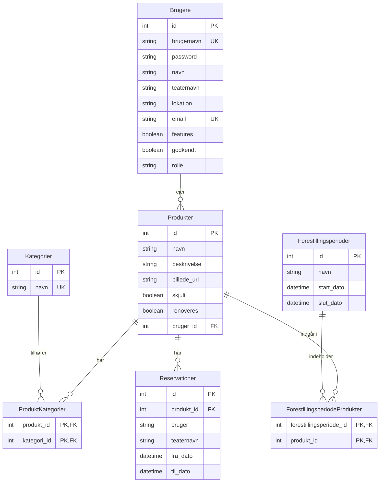

# Database ER Diagram

## Forklaring

### Entiteter
- **Brugere**: Teatre/brugere der kan oprette og dele rekvisitter
- **Produkter**: Rekvisitter der kan deles mellem teatre
- **Kategorier**: Kategorisering af produkter (f.eks. møbler, kostumer, etc.)
- **Forestillingsperioder**: Perioder hvor rekvisitter er i brug til en forestilling
- **Reservationer**: Reservationer af produkter fra andre teatre

### Relationer
- En **Bruger** kan eje mange **Produkter** (1:N)
- Et **Produkt** kan have mange **Kategorier** via junction-tabel (N:M)
- En **Forestillingsperiode** kan have mange **Produkter** via junction-tabel (N:M)
- Et **Produkt** kan have mange **Reservationer** (1:N)
