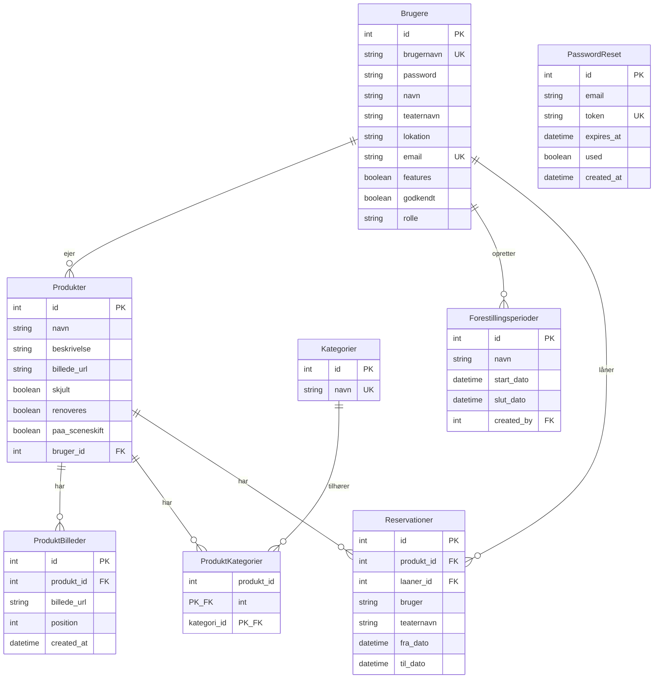

# Database ER Diagram

## Forklaring

### Entiteter
- **Brugere**: Teatre/brugere der kan oprette og dele rekvisitter
- **Produkter**: Rekvisitter der kan deles mellem teatre
- **ProduktBilleder**: Billeder tilknyttet et produkt (understøtter flere billeder per produkt)
- **Kategorier**: Kategorisering af produkter (f.eks. møbler, kostumer, etc.)
- **Forestillingsperioder**: Perioder hvor rekvisitter er i brug til en forestilling
- **Reservationer**: Reservationer af produkter fra andre teatre
- **PasswordReset**: Tokens til nulstilling af adgangskode

### Relationer
- En **Bruger** kan eje mange **Produkter** (1:N)
- En **Bruger** kan oprette mange **Forestillingsperioder** (1:N)
- En **Bruger** kan have mange **Reservationer** som låner (1:N)
- Et **Produkt** kan have mange **Billeder** (1:N)
- Et **Produkt** kan have mange **Kategorier** via junction-tabel (N:M)
- Et **Produkt** kan have mange **Reservationer** (1:N)

### Bemærkninger
- `paa_sceneskift`: Angiver om produktet er på brugerens lager (false) eller Sceneskifts hovedlager (true)
- `billede_url` i Produkter beholdes for bagudkompatibilitet
- `laaner_id` i Reservationer refererer til den bruger der har lavet reservationen
- `position` i ProduktBilleder bruges til at sortere billeder (0 = primært billede)
